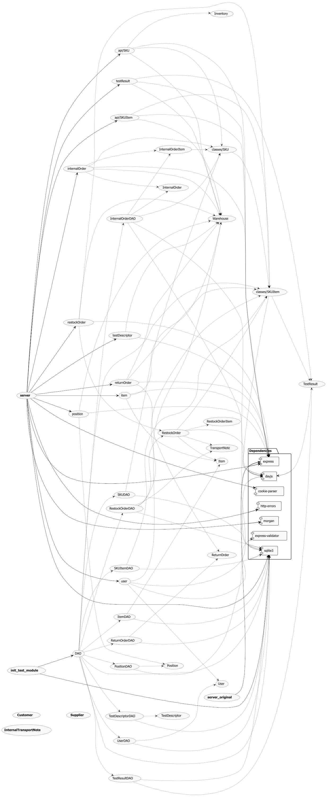

# Integration and API Test Report

Date:

Version:

# Contents

- [Dependency graph](#dependency graph)

- [Integration approach](#integration)

- [Tests](#tests)

- [Scenarios](#scenarios)

- [Coverage of scenarios and FR](#scenario-coverage)

# Dependency graph 

# Integration approach

The approach we decided to follow is the bottom up one. Using unit tests we checked that our base units work properly. Then we moved up using no mock on the database, instead, before each test, we initialized the correct db state.
- First step: test DAO methods (unit tests)
- Second step: run API testing

#  Integration Tests

   <define below a table for each integration step. For each integration step report the group of classes under test, and the names of
     Jest test cases applied to them, and the mock ups used, if any>
     
          
      Jest test cases should be here code/server/unit_test

## Step 1
| Classes         | mock up used |        Jest test cases        |
|-----------------|--------------|:-----------------------------:|
| RestockOrder    | -            |       get restock order       |
|                 | -            |    get restock order issued   |
|                 | -            |   change restock order state  |
|                 | -            | set SKUItems to restock order |
|                 | -            |       add restock order       |
|                 | -            |       add restock orderTest return items       |
| InternalOrder   | -            |      get internal orders      |
|                 | -            |   get internal orders issued  |
|                 | -            |  get internal orders accepted |
|                 | -            |     editing internal order    |
|                 | -            |       add internal order      |
|                 | -            |       add internal order undefined      |
| Position        | -            |         get positions         |
|                 | -            |         edit position         |
|                 | -            |     edit position ID only     |
|                 | -            |        delete position        |
| Test Descriptor | -            |      get test descriptors     |
|                 | -            |      get test descriptor      |
|                 | -            |      edit test descriptor     |
|                 | -            |     delete test descriptor    |
| Item    |       -      | add item                                       |
|         |       -      | add duplicate item                             |
|         |       -      | get an item by id                              |
|         |       -      | get a non existing item by id                  |
|         |       -      | get all items                                  |
|         |       -      | Edit an existing item                          |
|         |       -      | Control content after editing an existing item |
|         |       -      | Edit a non existing item                       |
|         |       -      | delete an item                                 |
|         |       -      | check existance of deleted item                |
| Test result |       -      | Add a test result                                |
|             |       -      | get all test results of an SKUItem               |
|             |       -      | get a specific test result of a specific SKUItem |
|             |       -      | Edit a test result for a specific SKUItem        |
|             |       -      | Delete a test result by id                       |
| User    |       -      | get User            |
|         |       -      | get User null       |
|         |       -      | get Users           |
|         |       -      | get suppliers       |
|         |       -      | check inserted user |
|         |       -      | change user type    |
|         |       -      | delete user         |
| SKU     |       -      | get sku             |
|         |       -      | get sku null        |
|         |       -      | get skus            |
|         |       -      | modify sku          |
|         |       -      | delete sku          |
| SKUItem |       -      | get sku item        |
|         |       -      | get sku item null   |
|         |       -      | get sku items       |
|         |       -      | get available sku items |
|         |       -      | modify sku item     |
|         |       -      | delete sku item     |
| returnOrder |       -       | get return orders |
|             |       -       | get return order  |
|             |       -       | get return order null  |
|             |       -       | delete return order |

# API testing - Scenarios

<If needed, define here additional scenarios for the application. Scenarios should be named
 referring the UC in the OfficialRequirements that they detail>

## Scenario UCx.y

| Scenario |  name |
| ------------- |:-------------:| 
|  Precondition     |  |
|  Post condition     |   |
| Step#        | Description  |
|  1     |  ... |  
|  2     |  ... |

# Coverage of Scenarios and FR

<Report in the following table the coverage of  scenarios (from official requirements and from above) vs FR. 
Report also for each of the scenarios the (one or more) API Mocha tests that cover it. >  Mocha test cases should be here code/server/test

| Scenario ID | Functional Requirements covered | Mocha  Test(s)         |
|-------------|---------------------------------|------------------------|
| UC1.1       | FR2.1                           | Testing UC 1.1         |
| UC1.2       | FR2.1                           | Testing UC 1.2         |
| UC1.3       | FR2.1                           | Testing UC 1.3         |
| UC2.2       | FR3.1.1                         | Testing UC 2.2         |
| UC2.3-UC2.4 | FR3.1.1                         | Testing UC 2.3 and 2.4 |
| UC2.5       | FR3.1.2                         | Testing UC 2.5         |
| UC5.1       | FR5.8                           | Testing UC5.1          |
| UC5.2       | FR5.8.2                         | Testing UC5.2          |
| UC6.1       | FR5.9, FR5.10, FR5.11           | Testing UC6            |
| UC9         | FR6.6                           | Testing UC9            |
| UC10        | FR6.8                           | Testing UC10           |
| UC12.1      | -                               | Testing UC 12.1        |
| UC12.2      | -                               | Testing UC 12.2        |
| UC12.3      | -                               | Testing UC 12.3        |
| UC4.1       | FR1.1                           | Adding a new user : POST /api/newUser                          |
| -           | FR1.3                           | get users : GET /api/users                                     |
| UC4.2       | FR1.1                           | edit user : PUT /api/users/:username                           |
| UC4.3       | FR1.2                           | delete user : DELETE /api/users/:username/:type                |
| UC5.2.1     | FR3.2.1                         | add test result : POST /api/skuitems/testResult                |
| UC5.2.2     | FR3.2.1                         | add test result : POST /api/skuitems/testResult                |
| UC5.2.3     | FR3.2.1                         | add test result : POST /api/skuitems/testResult                |
| -           | FR3.2.2                         | edit test result : PUT /api/skuitems/:rfid/testResult/:id      |
| -           | FR3.2.3                         | delete test result : DELETE /api/skuitems/:rfid/testResult/:id |
| UC11.1      | FR7                             | add item : POST /api/item                                      |
| -           | FR7                             | getItembyId : GET /api/items/:id                               |
| UC11.2      | FR7                             | editItem : PUT /api/item/:id                                   |
| -           | FR7                             | deleteItemById : DELETE /api/items/:id                         |
