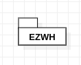
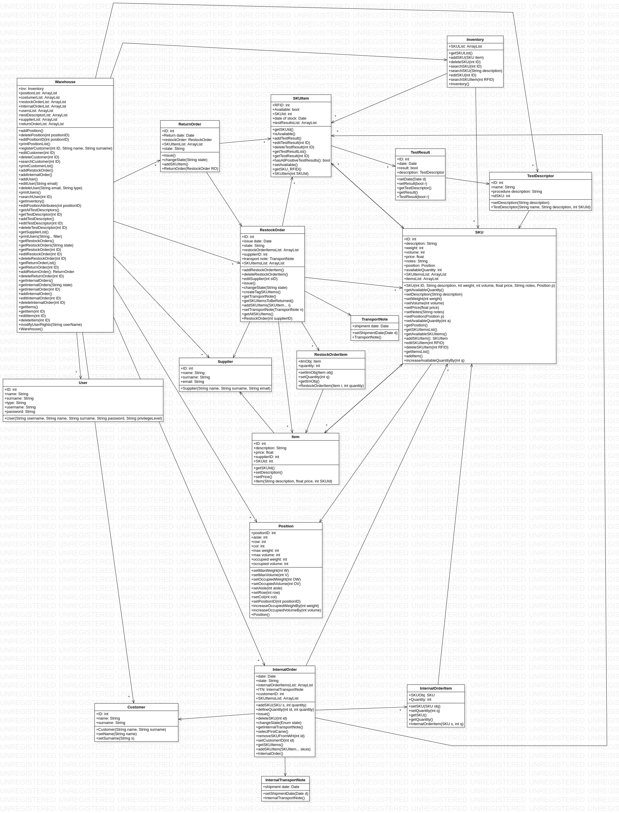

# Design Document 

Authors: 

Date:

Version:

# Contents

- [High level design](#package-diagram)
- [Low level design](#class-diagram)
- [Verification traceability matrix](#verification-traceability-matrix)
- [Verification sequence diagrams](#verification-sequence-diagrams)

# Instructions

The design must satisfy the Official Requirements document, notably functional and non functional requirements, and be consistent with the APIs

# High level design 

The application can be developed in different ways using different architectural styles. Two of them are in particular suitable for EZWH: client-server and layered. Both of them are almost equivalent, but they highlight different features; the first is more related to where the application is deployed, while the second one is related to the software itself.
The server has two components: the frontend, which is developed with web technologies (JavaScript, HTML, Css) and is in charge of collecting user inputs to send requests to the backend.
Together, they implement a layered style: Presentation layer (front end), Application logic and data layer (back end). 
Together, they implement also an MVC pattern, with the V on the front end and the MC on the back end.

## Package Diagram

# Low level design

# Verification traceability matrix

\<for each functional requirement from the requirement document, list which classes concur to implement it>

# Verification sequence diagrams
 

