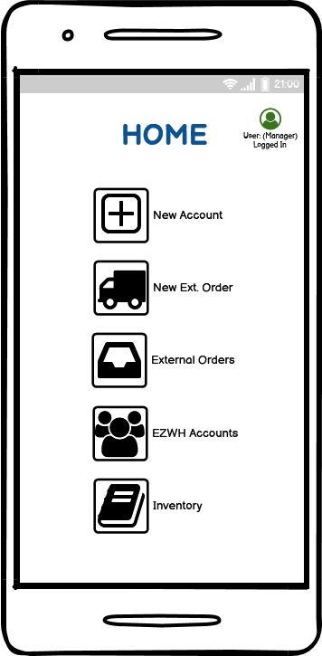
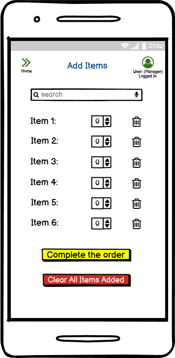
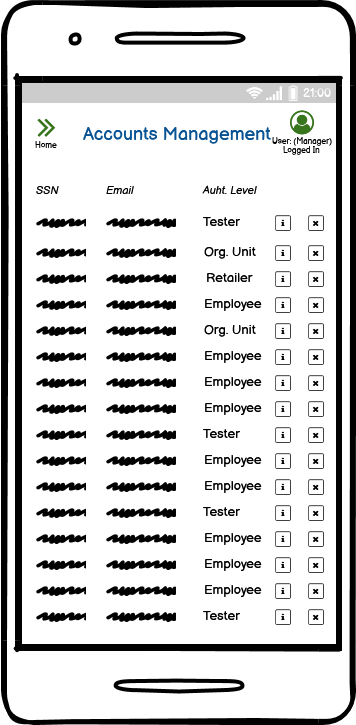
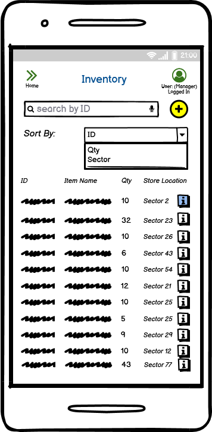

# Graphical User Interface Prototypes (Desktop - Mobile)

## Desktop

Authors: 

Date: 09/04/2022

Version: Desktop 1.0

### Login

### Accounts management

### Create a new account

### Inventory

### Inventory item description

### Add a new item

### Warehouse map

### Suppliers list

### Supplier details

### Add a new supplier

### External orders list

### External order details

### Create a new external order

### Internal orders list

### Internal order details

### Create a new internal order

### Internal orders history

## Mobile

Authors: 

Date: 11/04/2022

Version: 1.0

### Login

"?" forgot password

### Create a new account

### Accounts management

Accessable from Manager account, other employee levels can only change their default password.

### Home 1

"New Ext. Orders","External Orders", "EZWH Accounts" functionalities only for manager.

### Home 2

"New Int. Order" is a functionality for Org.Unit only.

### New External Order

### Catalogue

### External Order

### Details External Order

Only manager can modify or delete an external order.

### Accounts Management

### Accounts Info

### Inventory

The "+" is a manager functionality only.

### Item Detail

"Delete", "Threshold" and "Make order" are only available for manager.

### New Item for Inventory

ID is auto-generated.

### New Internal Order

Internal orders only for OU.

### Internal Orders

"Delete" is a functionality only for Manager and OU.

### Internal Order Detail

Modifications of internal orders are available only to Manager, Employee and OU.

### Test Result

